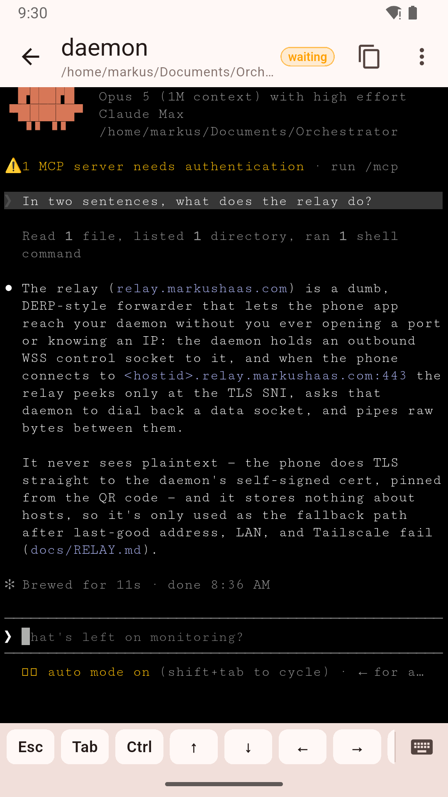
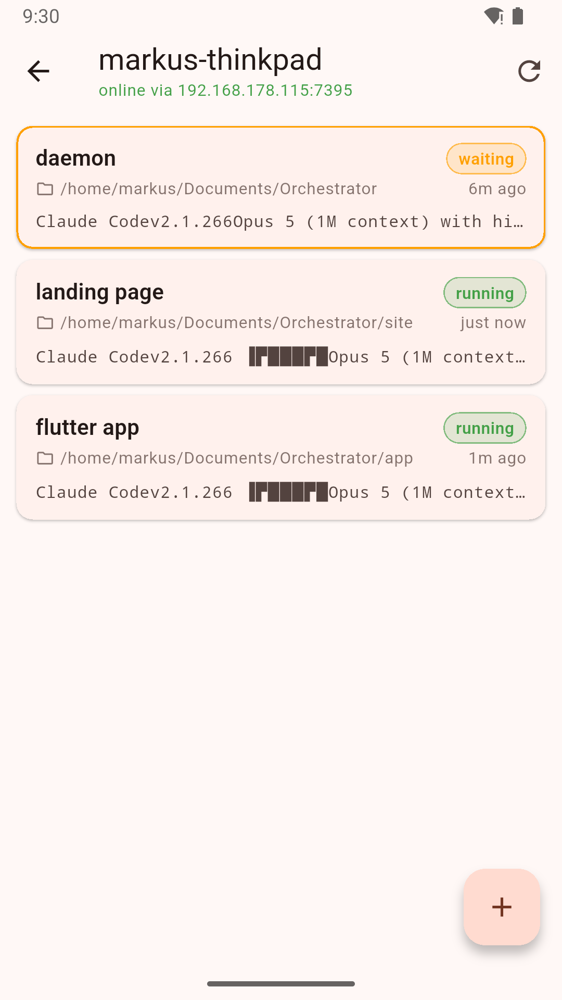

# Orchestrator

**Claude Code runs on your laptop. This lets you drive it from your phone.**

Start a session in any folder on your machine, then walk away. Your laptop keeps it
running — the phone is only a remote control, so locking it, closing the app or losing
signal changes nothing. Come back an hour later and the terminal is exactly where you
left it, still working.

<p align="center">
  
  
</p>

- **Nothing to set up.** No port forwarding, no firewall rules, no VPN. Your phone
  reaches your machine from anywhere, and the relay it goes through cannot read the
  traffic — your laptop's own certificate is pinned end to end.
- **A real terminal**, not a chat box. Scrollback, arrow keys, Ctrl-C, resize, and as
  many sessions at once as you like.
- **Your machine, your files.** Nothing runs in anyone else's cloud.
- **It tells you when Claude needs you.** A session waiting on a question jumps to the
  top of the list on your phone.

Install the app on the computer you want to reach, install the app on your phone, scan
one QR code. That is the whole setup.

The phone app is called **Orc Terminal**; <https://orc.markushaas.com> is the short
version of all of the above; **Your phone** under Install has the two ways to get it.

## Why not just SSH and tmux?

If you already SSH into your own machine from your phone and like it, this will not win
you over. It exists because four things kept getting in the way:

- **Reaching the machine at all.** A laptop behind home NAT needs port forwarding, a
  VPN, or a jump host. Here the daemon dials out to a relay, so there is nothing to open
  and no address to remember.
- **The keys Claude Code needs.** Esc, Ctrl-C, Tab and the arrows are not on a phone
  keyboard. They sit in a permanent row just above it.
- **Knowing when to look.** A session that has stopped to ask you something moves to the
  top of the list. With tmux you find out by checking.
- **Not babysitting the connection.** The session lives on your machine, not in the app,
  so closing the app or losing signal costs nothing — same as tmux, and the reason the
  phone side can stay this thin.

The daemon is a PTY plus an RPC layer, so none of this replaces your shell — it is the
same terminal, reached differently.

## Install

### Linux

```
curl -fsSL https://raw.githubusercontent.com/markusbug/Orchestrator/main/scripts/install.sh | sh
```

Then open **Orchestrator** from your applications menu, or run `orchestrator`.

- Installs the `.deb` if you have `dpkg`, the AppImage otherwise. Both are on the
  [releases page](https://github.com/markusbug/Orchestrator/releases) if you would rather
  do it by hand.
- On arm64 it installs the daemon only and pairs from the terminal — the window is
  x86_64 for now.
- On GNOME the tray icon needs the AppIndicator extension. Ubuntu ships it enabled;
  elsewhere run `gnome-extensions enable ubuntu-appindicators@ubuntu.com`. Without a
  tray, closing the window quits the app — your sessions keep running either way.

### macOS

1. Download `Orchestrator-<version>-arm64.dmg` from the
   [releases page](https://github.com/markusbug/Orchestrator/releases) and drag
   Orchestrator to Applications.
2. The app is not signed or notarized yet, so clear the download flag before opening it:

   ```
   xattr -dr com.apple.quarantine /Applications/Orchestrator.app
   ```

   Or double-click, let macOS refuse, then go to **System Settings → Privacy & Security**
   and click **Open Anyway**. (On macOS 15 and later, right-click → Open no longer works.)
3. Open Orchestrator.

The macOS build is compiled and signature-checked by CI but has not yet been run on a
real Mac. Treat it as beta.

### Windows

Not yet. The daemon has no ConPTY support, so the machine side is Unix-only today — see
[docs/DESKTOP.md](docs/DESKTOP.md).

### Your phone

- **iOS** — **Orc Terminal** is on TestFlight, currently `app-v0.1.7`. Join through the
  public link: <https://testflight.apple.com/join/usdtauzR>. It only installs while the
  current version has cleared Beta App Review — roughly a day after each new version —
  and otherwise says the beta is not accepting testers, so check it before passing it
  on. There is no App Store listing yet. Every `app-v*` tag builds both the signed
  TestFlight upload ([docs/TESTFLIGHT.md](docs/TESTFLIGHT.md)) and an unsigned IPA you
  can sideload instead ([MVP.md](MVP.md) has those steps).
- **Android** — **Orc Terminal** is on Google Play's internal testing track as
  `0.1.7 (7)`; ask at <https://orc.markushaas.com> to be added as a tester. The bundle
  is a local `flutter build appbundle --release` signed from `android/key.properties` —
  no CI job builds it yet.

## First run

The window offers one button to start the background service, then shows a QR code. Scan
it with the phone app and you are done. Closing the window leaves Orchestrator in the
tray or menu bar; quitting from there leaves your sessions running. To stop everything,
use **Shut down Orchestrator** in the tray menu or on the status card — it ends every
live session, so it asks first.

## Security

A paired phone gets a real terminal on your machine, so pairing a device grants the
same access as sitting at your keyboard. Traffic is end-to-end encrypted with your
machine's own certificate, which the phone pins — the relay carries bytes it cannot
read. [SECURITY.md](SECURITY.md) has the threat model, what the relay can and cannot
see, and how to report a vulnerability.

## License

MIT — see [LICENSE](LICENSE).

## Status

Working end to end: the daemon (Go, `daemon/`) on Ubuntu, the desktop app (Flutter,
`app/`) released as `desktop-v0.1.1`, the phone app — on TestFlight and on Play's
internal track from `app-v0.1.7` — and the hosted relay at `relay.markushaas.com`,
verified on 2026-09-06 with an iPhone on cellular. Not yet proven: the macOS app on real
hardware, and Windows at all. See [PLAN.md](PLAN.md) for the architecture and
milestones, [MVP.md](MVP.md) for scope, and [docs/DESKTOP.md](docs/DESKTOP.md) for how
the desktop app is built and packaged.

## Developing the daemon

```
make build
./bin/orchestrator serve --debug      # foreground, debug web client at https://localhost:7391/_debug/
./bin/orchestrator install            # run as a user service instead
```

`orchestrator` on its own opens the desktop app. The older subcommands (`status`, `pair`, `devices`, `sessions`, `relay`, `logs`) still work and are the way to drive a headless machine over SSH; they are no longer in the usage text because the app is the supported route.

Developer note: if a firewall is active on the host (`ufw status`), allow the port with `sudo ufw allow 7391/tcp`, otherwise the phone's connection is silently dropped. Users of the finished product never need this: the daemon connects outbound to the hosted relay at `relay.markushaas.com` by default, so phones reach it from anywhere without any port or firewall step (see [docs/RELAY.md](docs/RELAY.md)). The TLS certificate is self-signed; the phone pins its fingerprint at pairing time, and the browser will ask you to accept it once. `--debug` skips authentication for connections from the same machine, so only use it on a machine you trust.

## Run a relay

The relay removes every port and firewall step for end users: the daemon connects out, phones connect to `<hostid>.<relay-domain>:443`, and the relay pipes the daemon's own TLS through without seeing plaintext. `make build-relay` builds it; `make run-relay-dev` runs a self-signed one locally. Design in [docs/RELAY.md](docs/RELAY.md), deployment and operations in [deploy/relay/README.md](deploy/relay/README.md). Daemons use the hosted relay `https://relay.markushaas.com` by default; `orchestrator relay` shows the connection state, `orchestrator relay set https://relay.example` points at a self-hosted one, and `orchestrator relay off` disables it.

## Developing the phone app

```
cd app
flutter pub get
flutter analyze && flutter test            # unit tests plus a fake daemon over TLS
```

To exercise the app's networking against the real daemon, run `orchestrator pair` and pass its output to the live test:

```
ORCH_LIVE_PORT=7391 ORCH_LIVE_CODE=123456 ORCH_LIVE_FP=sha256:... flutter test test/live_test.dart
```

The iOS build runs in GitHub Actions on `app-v*` tags (`.github/workflows/ios.yml`) and produces an unsigned IPA for sideloading, plus a TestFlight upload when the signing secrets exist ([docs/TESTFLIGHT.md](docs/TESTFLIGHT.md)). See [MVP.md](MVP.md) for the protocol, scope, and sideloading steps.
